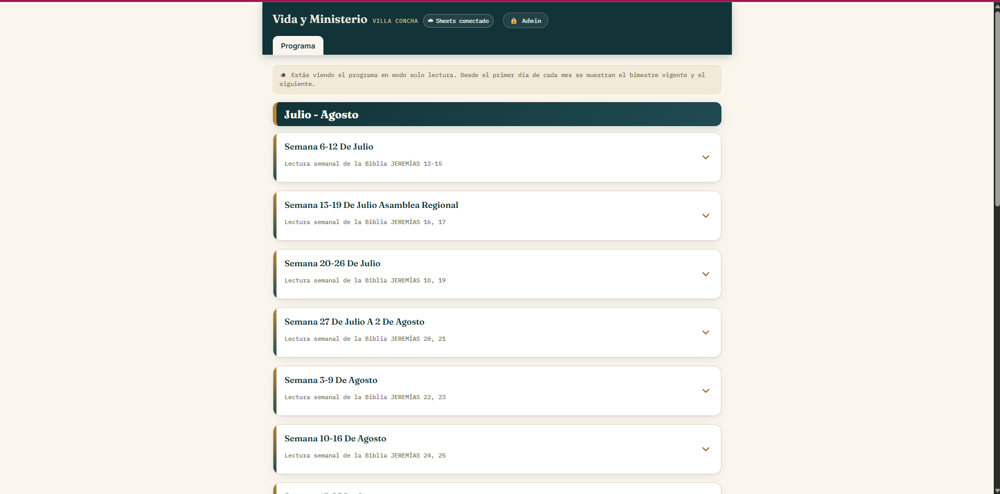
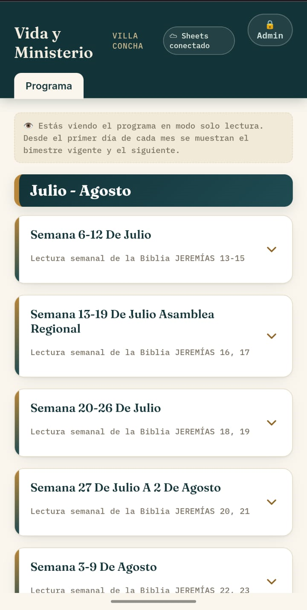

# &#x20;Vida y Ministerio — Villa Concha

> Aplicación web progresiva (PWA) para la gestión, consulta y organización de las asignaciones semanales del programa **Vida y Ministerio.**

🌐 [**Ver aplicación en producción**](https://vida-ministerio-villa-concha.vercel.app/)

📦 [**Ver código fuente en GitHub**](https://github.com/CDluyzGonzalez/vida-ministerio-villa-concha)

---

## 📋 Descripción

**Vida y Ministerio** —  es una aplicación web desarrollada para facilitar la consulta y gestión de las asignaciones correspondientes a las reuniones semanales.

La aplicación presenta la información organizada por períodos y semanas, proporcionando una interfaz clara, responsive y accesible desde computadores, tablets y dispositivos móviles.

---

## 🎯 Objetivo del proyecto

El objetivo principal es transformar un proceso de consulta basado en una hoja de cálculo extensa en una **experiencia más sencilla, visual y accesible**, manteniendo la información centralizada y facilitando la organización de las asignaciones.

La aplicación permite consultar de manera estructurada quién participa en cada sección de la reunión, organizar los programas por períodos bimestrales y gestionar las responsabilidades asignadas a los participantes.

---

## ✨ Características principales

### 📅 Organización semanal

Las asignaciones están organizadas por semanas, permitiendo consultar rápidamente:

* Fecha de la reunión.
* Secciones del programa.
* Participantes asignados.
* Responsabilidades específicas.
* Información correspondiente a cada parte de la reunión.

### 🗓️ Organización por bimestres

La aplicación permite trabajar con diferentes períodos del programa mediante archivos de datos independientes.

Actualmente contempla períodos como:

* Marzo — Abril
* Mayo — Junio
* Julio — Agosto
* Septiembre — Octubre

Esta estructura facilita la actualización y mantenimiento de la información.

### 👥 Gestión de participantes

La aplicación utiliza información de los publicadores autorizados para organizar las asignaciones semanales y bimestrales.

La utilización de los nombres de los participantes en la fuente de datos cuenta con la autorización correspondiente para este propósito.

Por razones de privacidad y seguridad, los identificadores, URLs internas y configuraciones sensibles de la fuente de datos no forman parte del repositorio público.

### 🔎 Consulta rápida

La interfaz permite localizar participantes y consultar sus asignaciones sin tener que navegar por una hoja de cálculo extensa.

### 👤 Asignación de responsabilidades

El sistema contempla diferentes tipos de responsabilidades y restricciones para determinar qué participantes pueden ser asignados a determinadas partes del programa.

Entre las categorías contempladas se encuentran:

* Busquemos perlas escondidas.
* Tesoros de la Biblia.
* Nuestra Vida Cristiana.
* Estudio bíblico.
* Lectura de la Biblia.
* Seamos mejores maestros.
* Introducción y conclusión.
* Oraciones.
* Otras asignaciones.

### 📄 Generación de PDF

La aplicación permite generar una versión en PDF del programa utilizando:

* `jsPDF`
* `html2canvas`

El PDF se prepara en un modo de visualización específico para conservar una presentación limpia y adecuada para compartir o imprimir.

---

# 📱 Progressive Web App

El proyecto incorpora características de **Progressive Web App (PWA)** para ofrecer una experiencia similar a una aplicación instalada.

Actualmente cuenta con:

* Web App Manifest.
* Nombre de la aplicación.
* Iconos de instalación.
* Configuración `standalone`.
* Orientación para dispositivos móviles.
* Color de tema.
* Instalación en dispositivos compatibles.
* Capturas de pantalla específicas para la interfaz de instalación.

La configuración del manifest permite que la aplicación pueda instalarse como una aplicación independiente en los dispositivos compatibles.

---

## 🖥️ Diseño responsive

Uno de los objetivos principales del proyecto fue mejorar la experiencia de consulta frente al sistema anterior basado en Google Sheets.

La interfaz fue diseñada para adaptarse a:

* 📱 Smartphones.
* 📲 Tablets.
* 💻 Laptops.
* 🖥️ Computadores de escritorio.

El diseño prioriza especialmente la **legibilidad y facilidad de navegación**, reduciendo la cantidad de información visual presentada simultáneamente.

---

# 🏗️ Arquitectura

La aplicación utiliza una arquitectura frontend basada en JavaScript y una capa externa de integración para la comunicación y persistencia de información.

```text
┌─────────────────────────────────────┐
│             Usuario                 │
│   Smartphone / Tablet / Desktop     │
└──────────────────┬──────────────────┘
                   │
                   ▼
┌─────────────────────────────────────┐
│          Aplicación Web             │
│                                     │
│ HTML5 + CSS3 + JavaScript           │
│                                     │
│ • Interfaz                          │
│ • Estado de la aplicación           │
│ • Asignaciones                      │
│ • Búsqueda                          │
│ • Validaciones                      │
│ • Generación de PDF                 │
└──────────────────┬──────────────────┘
                   │
                   ▼
┌─────────────────────────────────────┐
│        Google Apps Script           │
│        Capa de integración          │
│                                     │
│ • Lectura de información            │
│ • Escritura de cambios              │
│ • Comunicación con Google Sheets    │
└──────────────────┬──────────────────┘
                   │
                   ▼
┌─────────────────────────────────────┐
│          Google Sheets              │
│       Persistencia remota           │
│                                     │
│ • Participantes                     │
│ • Configuración                     │
│ • Asignaciones                      │
│ • Cambios realizados desde la app  │
└─────────────────────────────────────┘
```

**Google Sheets funciona como fuente remota y sistema de persistencia de datos**, almacenando información de participantes, configuraciones, asignaciones y cambios realizados desde la aplicación.

**Google Apps Script** actúa como capa de integración entre el frontend y Google Sheets, permitiendo gestionar las operaciones de lectura y escritura sin exponer directamente las configuraciones internas.

La aplicación también mantiene **datos locales como plantilla y mecanismo de respaldo**, permitiendo conservar la experiencia de consulta cuando la fuente remota no está disponible.

---

# 📁 Estructura del proyecto

```text
vida-ministerio-villa-concha/
│
├── apps-script/
│   └── codigo.gs
│
├── css/
│   └── styles.css
│
├── js/
│   ├── app.js
│   ├── functions.js
│   │
│   └── data/
│       ├── people.js
│       ├── varones.js
│       ├── program.js
│       ├── marzo-abril.js
│       ├── mayo-junio.js
│       ├── julio-agosto.js
│       └── septiembre-octubre.js
│
├── icons/
│   ├── icon-192.png
│   └── icon-512.png
│
├── screenshots/
│   ├── desktop.png
│   └── mobile.png
│
├── index.html
├── manifest.json
├── apple-touch-icon.png
├── .gitignore
└── README.md
```

> ⚠️ La configuración utilizada para la integración con Google Apps Script y cualquier identificador o información sensible se mantiene fuera del repositorio público.

---

# 🛠️ Tecnologías utilizadas

## Frontend

* **HTML5**
* **CSS3**
* **JavaScript (Vanilla JS)**
* Responsive Web Design

## PWA

* **Web App Manifest**
* **PWA Icons**
* `beforeinstallprompt`
* `appinstalled`
* Responsive PWA Screenshots

## Integración y datos

* **Google Apps Script**
* **Google Sheets**
* **JavaScript Fetch API**
* **LocalStorage**

## Generación de documentos

* **jsPDF**
* **html2canvas**

## Seguridad

* **SHA-256**
* Token temporal para autorización de operaciones de escritura.
* Separación de configuraciones sensibles respecto al repositorio público.

## Desarrollo y despliegue

* **Git**
* **GitHub**
* **Vercel**
* **Visual Studio Code**
* **Chrome DevTools**
* **Live Server**

---

# 🔐 Seguridad y privacidad

La aplicación utiliza información de participantes para poder organizar las asignaciones del programa.

El uso de los nombres de los publicadores almacenados en la fuente de datos cuenta con la autorización correspondiente para la gestión de las asignaciones.

Para mantener el repositorio público seguro:

* No se incluyen identificadores de Google Sheets.
* No se incluyen configuraciones privadas de Google Apps Script.
* No se publican tokens de acceso.
* No se almacenan credenciales en el repositorio.
* El PIN administrativo no se almacena en texto plano.
* Las configuraciones sensibles se mantienen fuera del código público.

El repositorio contiene únicamente los componentes necesarios para comprender y ejecutar la parte pública de la aplicación.

---

# ⚙️ Ejecución local

## Requisitos

Para ejecutar la aplicación localmente se necesita:

* Navegador web moderno.
* Visual Studio Code.
* Extensión Live Server.

## 1. Clonar el repositorio

```bash
git clone https://github.com/CDluyzGonzalez/vida-ministerio-villa-concha.git
```

## 2. Entrar al proyecto

```bash
cd vida-ministerio-villa-concha
```

## 3. Abrir el proyecto

Abrir la carpeta desde Visual Studio Code.

## 4. Ejecutar con Live Server

Abrir `index.html` y seleccionar:

```text
Open with Live Server
```

La aplicación se abrirá en el navegador mediante un servidor local.

> La configuración necesaria para conectar la aplicación con los servicios externos debe mantenerse fuera del repositorio público.

---

# 📸 Capturas de pantalla

## 💻 Vista de escritorio



## 📱 Vista móvil



---

# 💡 Problema → Solución

## Problema

Antes de desarrollar esta aplicación, las asignaciones de las reuniones se gestionaban mediante una hoja de cálculo de Google Sheets.

Aunque este sistema permitía compartir la información, presentaba diferentes dificultades en el uso cotidiano:

* La información podía no actualizarse correctamente para todos los usuarios.
* Era más difícil encontrar rápidamente una asignación.
* La gran cantidad de cuadros y columnas hacía que la información se mostrara en tamaños reducidos.
* Consultar las asignaciones desde un teléfono no era una experiencia óptima.
* Las personas mayores podían encontrar especialmente complejo navegar y localizar información dentro de la hoja de cálculo.

## Solución

Se diseñó y desarrolló una aplicación web enfocada específicamente en la **consulta rápida, claridad visual y facilidad de uso**.

La nueva interfaz permite:

```text
Seleccionar período
       ↓
Seleccionar semana
       ↓
Consultar programa
       ↓
Ver participantes y responsabilidades
```

La aplicación mantiene Google Sheets como sistema de persistencia de la información, pero incorpora una interfaz web especializada para presentar y gestionar los datos de una manera más clara y práctica.

De esta manera, la información que anteriormente estaba distribuida en una hoja de cálculo extensa se presenta mediante una interfaz organizada y adaptada al uso cotidiano.

---

# 🧠 Retos técnicos

Durante el desarrollo se trabajó en diferentes retos técnicos:

### Gestión del estado

La aplicación mantiene diferentes estados para controlar:

* Programa actual.
* Bimestre seleccionado.
* Semanas abiertas.
* Búsqueda de participantes.
* Estado administrativo.
* Estado de conexión con Google Sheets.
* Procesos de guardado.

### Normalización de nombres

Se implementó normalización de nombres para facilitar las comparaciones entre diferentes fuentes de datos.

Esto permite manejar diferencias como:

* Mayúsculas y minúsculas.
* Tildes.
* Espacios adicionales.
* Algunos caracteres especiales.

### Reglas de asignación

Se implementaron reglas para determinar qué personas pueden participar en determinadas secciones.

Esto permite automatizar parte del proceso de organización de las reuniones y reducir asignaciones incompatibles.

### Respaldo local

Cuando la fuente de datos remota no responde correctamente, la aplicación puede utilizar los datos locales disponibles para mantener la experiencia de consulta.

### Generación de PDF

Se implementó un modo específico para preparar la interfaz antes de exportarla, ocultando elementos de edición y adaptando la visualización para generar un documento más limpio.

---

# 📈 Impacto de la solución

La aplicación transforma un proceso de consulta basado en una hoja de cálculo extensa en una interfaz diseñada específicamente para el uso cotidiano.

### Antes

**Google Sheets**

* Información distribuida en múltiples cuadros.
* Mayor dificultad para localizar asignaciones.
* Información visualmente pequeña.
* Experiencia limitada en dispositivos móviles.
* Mayor dificultad para usuarios con poca familiaridad con hojas de cálculo.

### Después

**Aplicación web**

* Organización semanal.
* Información visualmente más clara.
* Consulta rápida de asignaciones.
* Búsqueda de participantes.
* Consulta desde cualquier dispositivo.
* Interfaz responsive.
* Instalación como PWA.
* Gestión estructurada de asignaciones.
* Generación de PDF.
* Proceso de asignación de participantes más práctico y ágil.

---

# 🚀 Mejoras futuras

Algunas funcionalidades que podrían incorporarse posteriormente:

* Incorporar notificaciones de nuevas asignaciones.
* Añadir historial de cambios.
* Incorporar estadísticas de participación.
* Crear un panel administrativo más avanzado.
* Implementar una API backend propia.
* Migrar progresivamente la información a una base de datos dedicada.
* Mejorar las pruebas automatizadas.
* Incorporar métricas de rendimiento y accesibilidad.

---

# 🎓 Propósito del proyecto

Este proyecto forma parte de mi portafolio como desarrollador y representa la aplicación práctica de conocimientos de:

* Desarrollo web.
* JavaScript.
* Diseño responsive.
* Progressive Web Apps.
* Gestión de datos.
* Integración con servicios externos.
* Automatización de procesos.
* Diseño centrado en el usuario.
* Control de versiones.
* Despliegue de aplicaciones web.

Más allá de la implementación técnica, el proyecto representa un enfoque de **resolución de problemas reales mediante software**: identificar una necesidad, analizar las limitaciones del proceso existente, diseñar una solución y convertirla en una aplicación funcional.

---

# 👨‍💻 Autor

## Carlos D'Luyz

**Desarrollador de Software | Estudiante de Ingeniería de Sistemas**

Interesado en desarrollo web, aplicaciones full stack, automatización y creación de soluciones digitales orientadas a resolver problemas reales.

### Tecnologías utilizadas en este proyecto

`HTML5` · `CSS3` · `JavaScript` · `Google Apps Script` · `Google Sheets` · `PWA` · `jsPDF` · `html2canvas` · `Git` · `GitHub` · `Vercel`

### GitHub

[CDluyzGonzalez](https://github.com/CDluyzGonzalez)

---

## 📄 Licencia

Proyecto desarrollado con fines de portafolio profesional y demostración de habilidades de desarrollo de software.

---

⭐ **Si encuentras interesante el proyecto, puedes explorar el código fuente y conocer otros proyectos en mi perfil de GitHub.**
